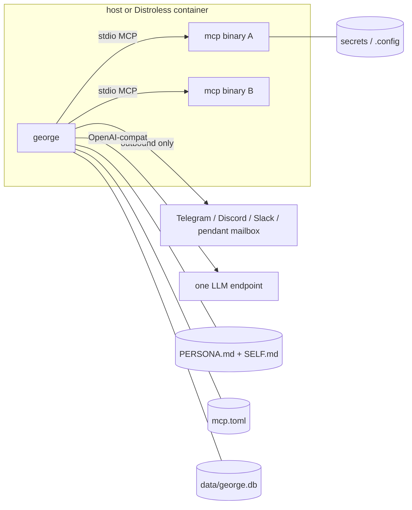
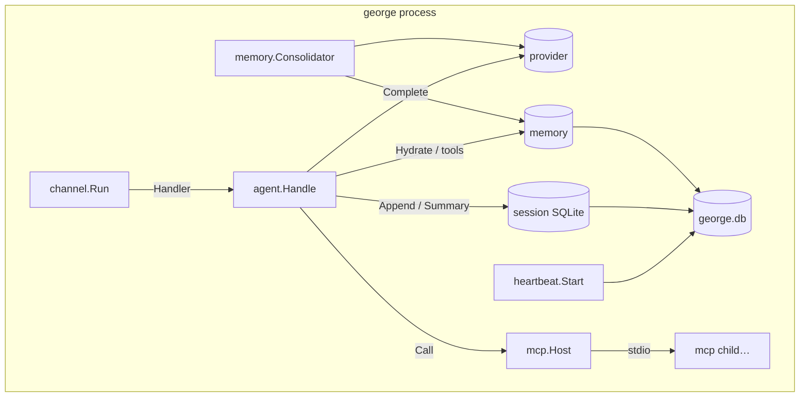
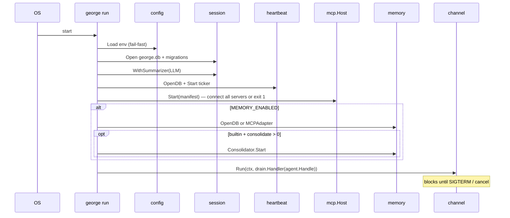
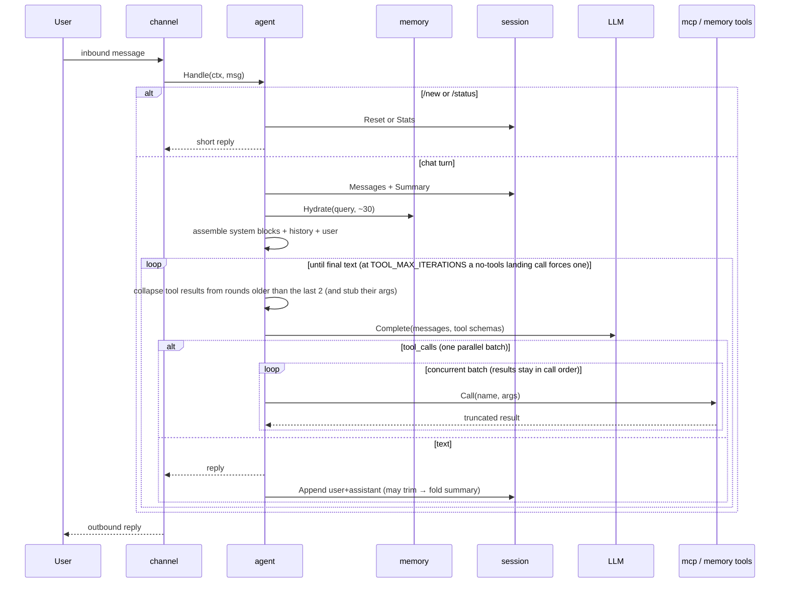
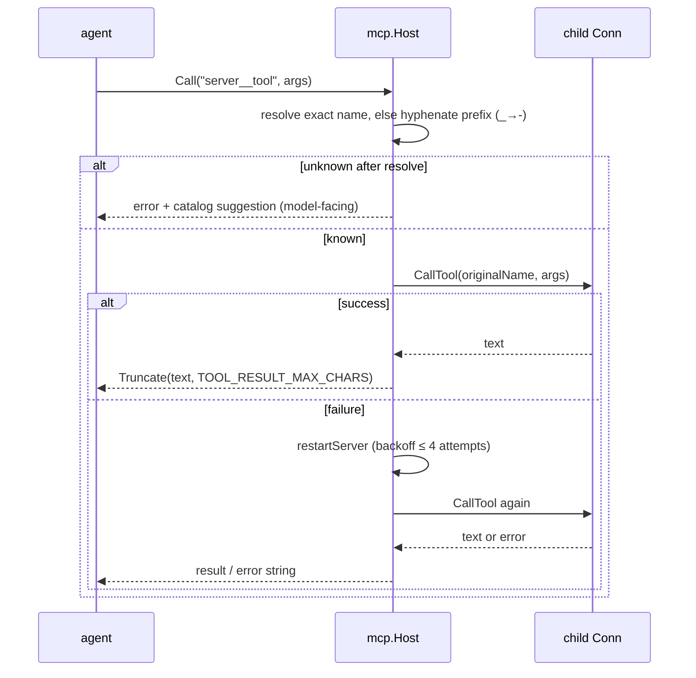
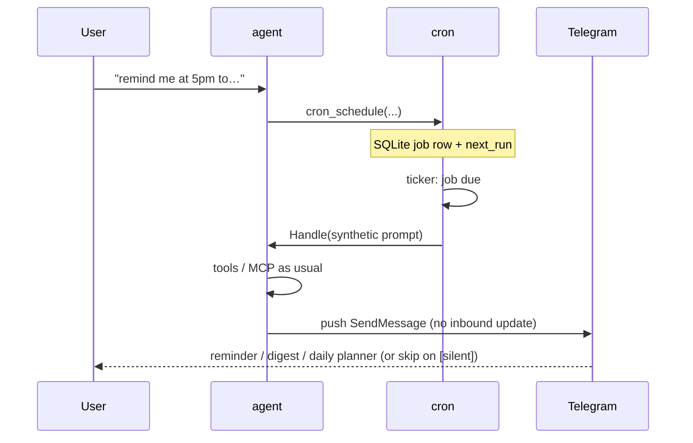
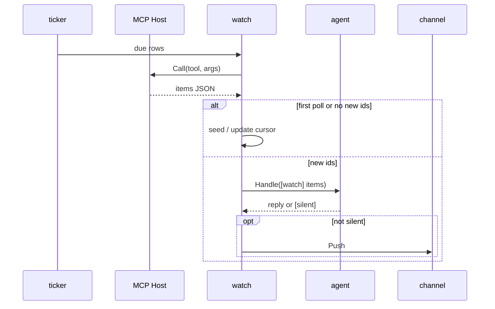

# Architecture

george is a single static Go binary — an **AI harness** that hosts one
persona, one LLM endpoint, and a set of MCP tool processes so the agent can
**plan on a long horizon**. Scaling is horizontal: one container (or systemd
unit) per brain. Harness contract (env, loop, memory):
[design.md](design.md). Hello path: [root readme](../readme.md).
Pendant, Cab, and gantree stay their own repos. This process does not import them.

## Container view



Nothing listens inbound. Health is `george status` (exit code) reading a
heartbeat row in SQLite — Docker exec form, no shell. Persona is writable when
self-notes are on (`SELF.md`); `:ro` disables that feature.

Deploy shapes: [deploy-native.md](deploy-native.md) ·
[deploy-docker.md](deploy-docker.md).

## Package layout

```text
cmd/george/          run | init | auth | status | version
cmd/release/         semver bump → tag → push (dev tooling)
internal/config/     env parse + fail-fast validation
internal/channel/    Channel interface; telegram/, discord/, slack/, pendant/, stdio/
internal/provider/   OpenAI-compatible Completer (one implementation)
internal/mcp/        manifest, spawn, list/call tools, truncate, restart
internal/mcpenable/  dynamic tool prefix grants
internal/agent/      prompt assembly, tool loop, collapse, reply
internal/session/    bounded history + rolling summary
internal/memory/     Memory interface, builtin SQLite/FTS5, MCP adapter, consolidator
internal/persona/    load PERSONA.md + SELF.md
internal/selfnote/   SELF.md tool + distill on /new
internal/websearch/  builtin web_search (Brave Search HTTP)
internal/heartbeat/  singleton row for Docker healthcheck
internal/drain/      in-flight turn wait on SIGTERM
internal/cron/       scheduled turns → agent → channel push
internal/watch/      poll MCP fetch tools; wake only on new item ids
internal/examples/   /examples capability pings
internal/logfwd/     optional slog → chat
```

One provider implementation is deliberate: Gemini, ChatGPT, and local models all
speak OpenAI-compat. Model identity is `LLM_BASE_URL` + `LLM_MODEL` +
`LLM_API_KEY`.

## Process model (goroutines)

One OS process. Concurrent work:

| Goroutine | Job |
| --- | --- |
| channel poller | Telegram `getUpdates` / Discord Gateway / Slack Socket Mode / pendant mailbox WSS (`cmds` then `allow` on dial) / stdio; allowlist filter |
| agent handler | per message: assemble → model → tools → reply; follow-ups settle then steer the live turn (Telegram: workers=2 so `/cancel` + barge-in can run) |
| MCP children | one OS process per manifest server (stdio), supervised by host |
| heartbeat ticker | upsert `heartbeat` every ~15s |
| memory consolidator | optional timer (`MEMORY_CONSOLIDATE_MINUTES`; `0` = off) |
| cron + watch tickers | clock jobs → agent → push; fetch-tool polls → wake only on new ids |



## Boot sequence



## Message / agent loop

One turn is execution. Long-horizon planning is those turns chained across
memory, cron, watches, and `SELF.md` — same loop, later.



## MCP tool call (resolve → call → restart)



Children are **not** bound to the signal context. On SIGTERM the channel
stops accepting work, `drain.Gate` waits for the in-flight turn (default 2m),
then deferred `mcp.Host.Close()` tears down stdio sessions (killing children).

Operator details (naming, local REPL, why alias exists): [mcp.md](mcp.md).

## Data on disk

One WAL SQLite file: `$DATA_DIR/george.db`.

| Table | Owner package | Purpose |
| --- | --- | --- |
| `session` / `session_message` | `session` | history + rolling `summary` |
| `memory` / `memory_fts` | `memory` | structured long-term memory |
| `heartbeat` | `heartbeat` | singleton row for `george status` |
| cron / watch job rows | `cron` / `watch` | scheduled turns and fetch-tool cursors |

`SELF.md` lives in `PERSONA_DIR`, not SQLite. `/new` deletes the session row
(cascade messages + summary) after `Voice:` merges into `SELF.md` and
`Facts:` park as a memory episode. Memory rows are untouched.

## Prompt assembly (order)

1. System: `PERSONA.md` then `SELF.md` (+ memory persona-precedence note when memory on)
2. System: `[session summary]` (optional)
3. System: `[mcp prefixes]` when dynamic tools are on
4. History: user/assistant turns (bounded; trailing cron `— tools:` audit line stripped, footer-only assistant turns omitted)
5. System: `[memory]` hydration block (optional, ≤ ~30 rows; after history so the prefix stays cacheable)
6. System: MCP server health (when tools are wired)
7. User: current message (typed words / `[photo]` / steers only)
8. System: `[harness]` location + `[current time]` + `[hours]` + `[aims]` (rating suffix when the ledger has rows) + `[todo]` (the pocket list, oldest first, with row ids) + `[progress]` on the daily planner turn only (week lines on the week-start planner only) + `[loops]` (prompt-only; not session history)
9. System: follow-up / conversation / `mcp_enable` review / cron tool-first notes as applicable

Tool schemas are attached on the completion request, not as chat messages.
Clock used to ride on the user body; that leaked into “raw message text.”

Read the completed Completer request (not the inserts): PWA inbound JSON
in `internal/agent/testdata/pendant/inbound_geo.json` is parsed by
`pendant.InboundTurn`, run through `Handle`, and pinned as
`completer_geo.txt` (agent layout) and `completer_geo_gemini_wire.txt`
(Gemini OpenAI-compat body). GPS-off is `inbound_nogeo.json` /
`completer_nogeo.txt`. Gate: `TestPendantInbound_CompleterPayload`. Clock
is frozen at 2026-09-14 12:02 PDT so the dump is stable. Production
`CRON_TZ` still uses `time.Now`. Memory hydration, `[hours]`, MCP health,
wait notes, and tool schemas are omitted there so the mouth contract is
readable; they still append after this prefix when those subsystems are on.
Hours, aims, and loops need Memory: `completer_horizon_harness.txt`. The
whole board — memory, cron `[wakes]`, Cab `[surface]`, pendant `[room]`
(the channel's cached face / backdrop / theme notices, stamped only when
`pendant__*` is in the catalog), `[last contact]` — is
`completer_fullboard_harness.txt`. `prompt_wire_test.go` posts the same
turn through a real `provider.Client` to an `httptest` server and diffs
the HTTP body against those same goldens, so agent layout and wire cannot
drift apart. `go test ./internal/agent/ -run Payload -update` rewrites
goldens; read the diff before trusting it.

The `[harness]` header names only the tags present (`location and clock`
on a memory-off turn; `location, clock, hours, horizon, wakes, surface,
input, room, and last contact` on the full board, where the Cab Auto
fixture carries `input: spoken`). A planner turn adds `progress`.
`[aims]` / `[todo]` / `[loops]` carry `(12d
ago)` from `updated_at` after the first day, `[loops]` past three weeks add
`— resolve or memory_forget`, and all three say `(+N more — …)`
instead of truncating silently. `[todo]` carries no stale cue: a task the
human has not done is still a task. Rows already
on `[aims]` / `[todo]` / `[loops]` are dropped from `[memory]` hydration. `[hours]` is skipped (not "unknown")
when the backend cannot do a live-row lookup (`memory.ErrNotSupported`,
MCP memory).

Gemini's OpenAI-compat layer keeps **one** system instruction. A trailing
`[harness]` `role=system` after the user is dropped or overwrites the
persona — Tim never sees NOW/GPS without a tool. `provider.WireMessages`
folds every system block into one leading system message for `gemini*`
models: standing blocks (persona, summary, hydration) first so identity
leads and the stable prefix stays cacheable, this-turn blocks (`[harness]`,
wait note) last for recency. OpenAI/Ollama keep the trailing system (prefix
cache). `LLM_SYSTEM_FOLD=auto|one|many` overrides the model-name guess —
`one` for a local chat template that renders system only at position 0.

## External dependencies (import over write)

| Concern | Library | Why |
| --- | --- | --- |
| MCP client | `github.com/modelcontextprotocol/go-sdk` | Official SDK; stdio transport, schema handling |
| SQLite | `modernc.org/sqlite` | Pure Go (no CGO), FTS5 works, one file DB |
| Telegram | `github.com/go-telegram/bot` | Zero-dep, maintained, long-poll native |
| LLM client | `github.com/openai/openai-go/v3` | Official; custom `base_url` covers Gemini, xAI, Ollama |
| Env config | `github.com/caarlos0/env/v11` | Struct tags → env, tiny |
| MCP manifest | `github.com/pelletier/go-toml/v2` | Minimal TOML for `mcp.toml` |
| Logging | stdlib `log/slog` | JSON to **stderr** (stdio REPL stays clean) |

Why each pick stuck: [design.md](design.md#decisions).

## Cron push



Outbound push needs a channel API beyond “reply to the update that invoked
Handle” — Telegram chat/user id is stored with the job from the scheduling turn.

## Event watches

Poller is code, not the agent. Quiet ticks never call the Completer.



A quiet watch polls a tool and does not call the model.

## Streaming replies

Default on: `STREAM_REPLIES=true`. Channel attaches a `ReplyWriter`; agent uses
`provider.CompleteStream` when available.

```mermaid
sequenceDiagram
  participant L as LLM stream
  participant A as agent
  participant T as Telegram

  A->>T: SendMessage("…")
  loop token chunks
    L-->>A: delta
    A->>T: editMessageText (throttled)
  end
  A->>T: Finish (final text; overflow as extra messages)
```

Finish is the last **visible** step. `sessions.Append` and wait-cron
`AfterReply` run after it so a complete draft is not stuck italic while
SQLite fold or cron work happens. Tool-call chunks skip live text
updates; cron push stays buffered.

