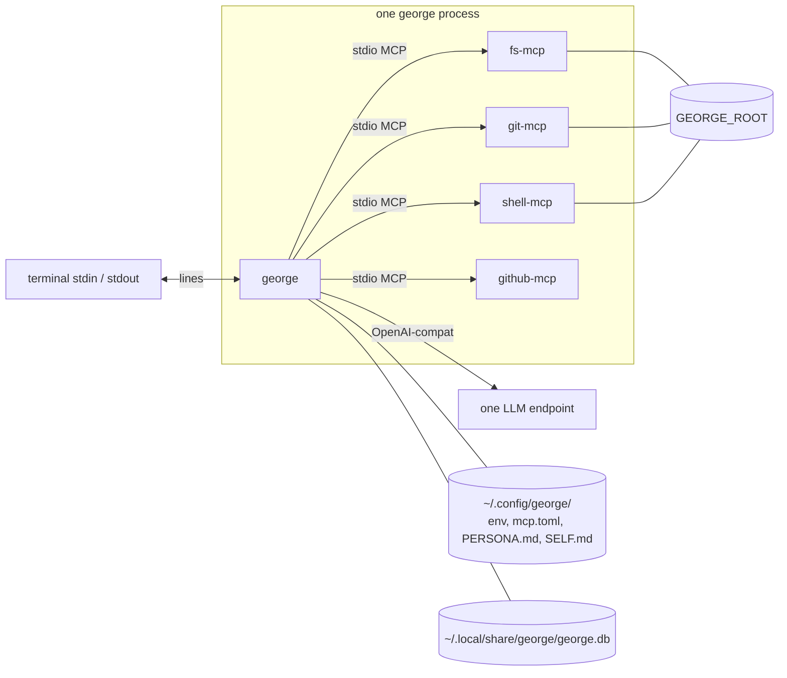
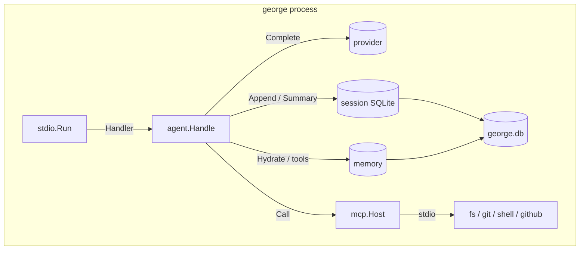
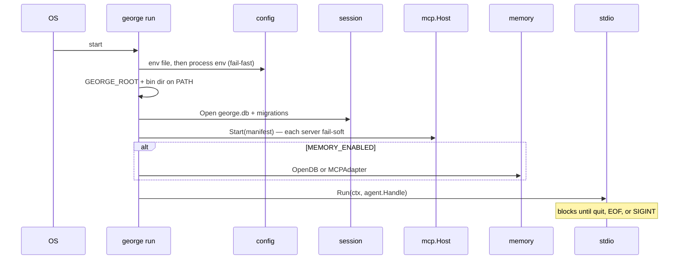
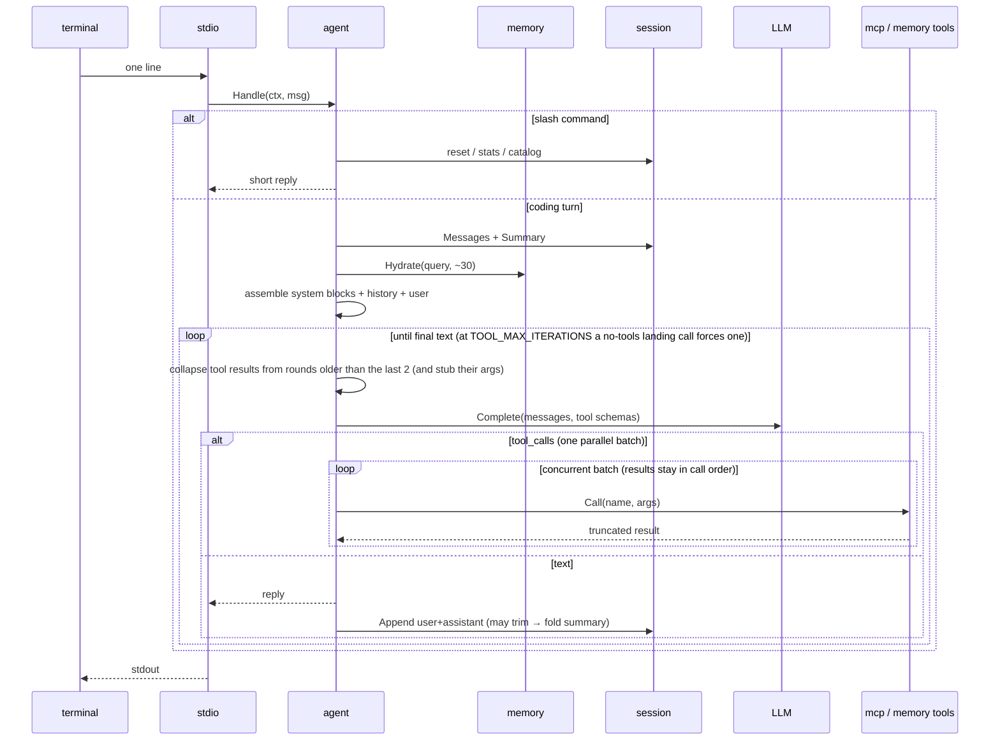
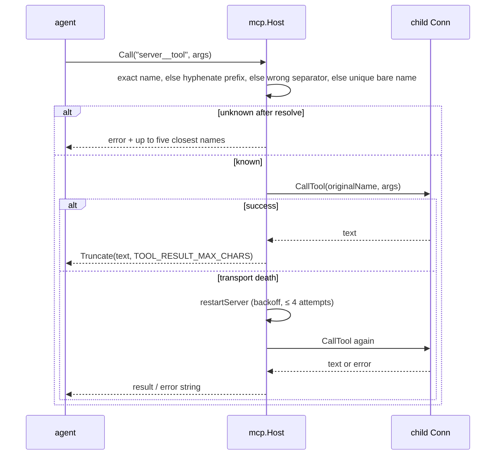

# Architecture

george is a single static Go binary — a CLI coding agent. You run it in a
repo, it talks on stdin/stdout, and it exits when you quit. One process, one
LLM endpoint, four MCP children rooted at that repo (`fs`, `git`, `shell`,
`github`). Hello path: [root readme](../readme.md). What was cut and what is
still open: [coding-agent-plan.md](coding-agent-plan.md). Tool names:
[coding-mcp.md](coding-mcp.md). Pendant, Cab, and gantree stay their own
repos. This process does not import them.

## Process view



Nothing listens inbound. `cd repo && george` is the whole UX. `GEORGE_ROOT`
is the git toplevel of the cwd (a `.git` file counts, so worktrees work), or
the cwd when no repo encloses it. An already-set `GEORGE_ROOT` wins. Manifest
`args` expand `${VAR}` before the child starts, so `mcp.toml` says
`--root ${GEORGE_ROOT}`.

`george tools-fetch` installs the four binaries under
`~/.local/share/george/bin`. `george run` puts that directory first on
`PATH` for its children.

There is no shell sandbox and no approval prompt. `shell__command_run` runs
as you, in `--root`. Git is the undo. The contract is the only guard on
untracked files, paths outside the root, and `git` commands typed through
the shell (`push`, `reset --hard`, `clean`).

## Where it lives

| What | Where |
| --- | --- |
| Model and keys (`LLM_*`, `BRAVE_SEARCH_API_KEY`, `GITHUB_TOKEN`) | `~/.config/george/env` |
| MCP manifest | `~/.config/george/mcp.toml` |
| `PERSONA.md`, `SELF.md` | `~/.config/george/` |
| `george.db` (session, memory, `mcp_enable`, budgets) | `~/.local/share/george/george.db` |
| MCP binaries | `~/.local/share/george/bin` |
| Root | git toplevel of the cwd |

`GEORGE_CONFIG_DIR` overrides the config directory. Data follows
`XDG_DATA_HOME` (default `~/.local/share`). `config.Load` reads the env file
with godotenv before parsing; a variable already in the process environment
wins. `DATA_DIR`, `PERSONA_DIR`, and `MCP_MANIFEST` override the three paths
when set. `george init` writes the config directory once and skips files
that already exist.

Boot fails when a removed assistant variable is set (`CHANNEL`, `TELEGRAM_*`,
`CRON_*`, `WATCH_*`, and the rest of `config.Retired`). An old env file
should say so, not quietly do nothing.

## Package layout

```text
cmd/george/          run | init | tools-plan | tools-fetch | version
cmd/release/         semver bump → tag → push (dev tooling)
internal/config/     env file + XDG paths + fail-fast validation
internal/channel/    Channel interface; stdio/ REPL
internal/provider/   OpenAI-compatible Completer (one implementation)
internal/mcp/        manifest, spawn, list/call tools, truncate, restart, tools-fetch
internal/mcpenable/  dynamic tool prefix grants
internal/agent/      prompt assembly, tool loop, collapse, reply
internal/session/    bounded history + rolling summary
internal/memory/     Memory interface, builtin SQLite/FTS5, MCP adapter
internal/persona/    embedded contract + PERSONA.md + SELF.md
internal/selfnote/   SELF.md tool + distill on /new
internal/websearch/  builtin web_search (Brave Search HTTP)
internal/slash/      REPL command catalog
```

One provider implementation is deliberate: Ollama, llama.cpp, and hosted
APIs all speak OpenAI-compat. Model identity is `LLM_BASE_URL` + `LLM_MODEL` +
`LLM_API_KEY`. The eval grades one local id,
`qwen3.6:35b-a3b-coding`.

## Process model

One OS process. The REPL reads the next line only after the reply is done,
so a turn is not steered mid-flight.

| Piece | Job |
| --- | --- |
| stdio REPL | prompt `> `, one line in, one reply out; `/quit` `/exit` `/q` leave; EOF leaves |
| agent handler | that line: assemble → model → tools → reply |
| MCP children | one OS process per manifest server that connected (stdio) |
| signal context | SIGINT / SIGTERM cancels the run context; the in-flight turn stops with it |



Logs are JSON on stderr so the REPL on stdout stays readable.

## Boot sequence



A missing binary or a missing `GITHUB_TOKEN` skips that server and leaves
the others up. A bad manifest still exits 1. `fs`, `git`, `shell`, and
`github` are `force = true` in `deploy/mcp.toml`, so their schemas stay
published and a turn does not spend a round on `mcp_enable` before an edit.

## Message / agent loop

One turn is one human line. The REPL does not read again until `Handle`
returns.



Slash commands the agent handles: `/new`, `/cancel`, `/status`, `/tools`,
`/perf`, `/memstats`, `/toolstats`, `/tokens`, `/help`, `/brief`, `/short`,
`/off`. `/cancel` only lands if it is the line being handled; the REPL does
not read during a turn, so SIGINT is what stops one that is already running.

The loop keeps the last two tool rounds whole, including a parallel batch.
Older rounds become a one-line marker in-process. No completion is spent to
describe a tool pair. A name that does not resolve gets one
grammar-constrained retry (at most five closest names). A call printed as
JSON is salvaged and run. When `TOOL_MAX_ITERATIONS` (default 25) is spent,
tools are withheld and one landing call must answer in text. `/toolstats`
counts the repairs.

## MCP tool call (resolve → call → restart)



Wrong-separator repair covers a real prefix joined the wrong way
(`fs.file_get`, `git_status_get`, `shell-command_run`) and counts as
`prefix_alias`. A bare name (`file_patch`) or an invented prefix resolves
only when exactly one published tool has that base name. A real prefix plus
a wrong tool (`fs__get_file`) is left to the closest-name hint. Argument
errors and cancel do not restart the child.

On SIGINT the REPL returns, then deferred `mcp.Host.Close()` tears down the
stdio sessions.

Operator details (naming, local REPL): [mcp.md](mcp.md).

## Data on disk

One WAL SQLite file: `$DATA_DIR/george.db` (default
`~/.local/share/george/george.db`). Open it with `sqlite3`.

| Table | Owner package | Purpose |
| --- | --- | --- |
| `session` / `session_message` | `session` | history + rolling `summary` |
| `memory` / `memory_fts` | `memory` | structured long-term memory (FTS5, no embeddings) |
| `mcp_enable` | `mcpenable` | prefix holds for dynamic tools |
| `mcp_budget` | `mcp` | per-server call caps from the manifest |

`SELF.md` lives in the config directory, not SQLite. `/new` deletes the
session row (cascade messages + summary) after `Voice:` merges into
`SELF.md` and `Facts:` park as a memory episode. Other memory rows are
untouched. A row lands because the model stored it, or because that fold
parked an episode. There is no consolidator timer.

The session id on stdio is the constant `george`. One conversation for this
process.

## Prompt assembly (order)

1. System: embedded contract, then `PERSONA.md`, then `SELF.md`
2. System: `[session summary]` (optional)
3. System: `[mcp prefixes]` when dynamic tools are on
4. History: user/assistant turns (bounded; filler words stripped from older user lines; empty assistant turns omitted)
5. System: `[memory]` hydration (optional, ≤ ~30 rows; after history so the prefix stays cacheable)
6. System: MCP server health (when tools are wired)
7. User: the current line
8. System: `[harness]` clock (`[current time]`)
9. System: `mcp_enable` review note when the prefix block is present

Tool schemas ride on the completion request, not as chat messages. The
`[harness]` header on a coding turn names the clock. Hydration and health
are omitted when those subsystems are off.

The contract is how the work is done and is what the eval grades.
`PERSONA.md` is name and voice, empty by default, and george does not write
it. `SELF.md` is coding taste the agent notes. A heading the harness used to
own is dropped from an old `PERSONA.md` at load time, without rewriting the
file.

Read the completed Completer request: a stdio line is run through `Handle`
and pinned as `internal/agent/testdata/stdio/completer.txt`. The clock is
frozen at 2026-09-14 12:02 PDT. `stdio_payload_test.go` also posts that turn
through a real `provider.Client` to an `httptest` server. Memory hydration,
MCP health, and tool schemas are omitted there so the mouth contract stays
readable; they still append when those subsystems are on.

The agent layout has the trailing `[harness]` `role=system` block after the
user. By default (`LLM_SYSTEM_FOLD=auto` or `one`) `provider.WireMessagesMode`
folds every system block into one leading system message on the wire
(standing blocks first, this-turn blocks last), because some renderers
(Ollama's `qwen3-coder`) drop every system message after the first. `many`
posts the layout as-is. The folded HTTP body is pinned as
`internal/agent/testdata/stdio/wire.txt`.

## External dependencies

| Concern | Library | Why |
| --- | --- | --- |
| MCP client | `github.com/modelcontextprotocol/go-sdk` | Official SDK; stdio transport, schema handling |
| SQLite | `modernc.org/sqlite` | Pure Go (no CGO), FTS5 works, one file DB |
| LLM client | `github.com/openai/openai-go/v3` | Official; custom `base_url` covers Ollama, llama.cpp, and hosted APIs |
| Env config | `github.com/caarlos0/env/v11` | Struct tags → env, tiny |
| Env file | `github.com/joho/godotenv` | `~/.config/george/env`; does not override the process env |
| XDG paths | `github.com/adrg/xdg` | Config dir and data dir |
| MCP manifest | `github.com/pelletier/go-toml/v2` | Minimal TOML for `mcp.toml` |
| Logging | stdlib `log/slog` | JSON to **stderr** |

## Streaming replies

Default on: `STREAM_REPLIES=true`. Stdio attaches a `ReplyWriter` and the
agent uses `provider.CompleteStream` when the completer supports it. Tokens
print as they arrive. Tool-call chunks skip live text updates. Finish runs
before `sessions.Append`, so a complete draft is not held back while the
SQLite fold runs.

`SHOW_THINKING` prints chain-of-thought on the stream. `TOOL_TRACE` prints
tool activity (`compact` by default). `SPINUP_NOTICE_MS` prints a still-working
line when a turn has produced no model output yet.

## Still the old shape

These are in this process today. The plan moves them; the diagrams above
describe the code, not that later cut.

- Memory rows have no repo-versus-you scope column. Hydration is one table.
- Stdio is a line scanner (a line may be up to 1MB). A paste is not yet one bracketed message, and the first Ctrl-C cancels the process.
- `[harness]` is the clock. A workspace line (root and branch) is not stamped.
