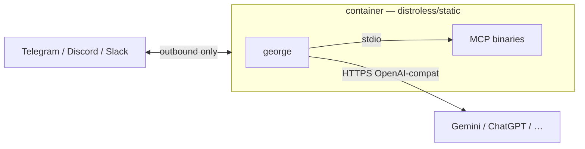

# Deploy: Docker (Hub / compose)

Run the **AI harness** as a **distroless container**: outbound chat only,
mounts for persona + `mcp.toml` + data. Fastest path when you want a cloud
OpenAI-compatible LLM (Gemini is the cookbook default) without installing a
local model host. Long-horizon pieces (memory, cron, `SELF.md`) are in this
image; MCP tools are optional extras you grant.

**Published images** (CI on every `main` push and `v*` tag):

| Registry | Image |
| --- | --- |
| [Docker Hub](https://hub.docker.com/r/shotah/george) | `shotah/george:latest` / `:edge` / `:0.x.y` |
| GHCR | `ghcr.io/shotah/george:…` (same tags) |

`:latest` / `:edge` = `main` · pin `:0.x.y` for production.

Harness contract (env, mounts, MCP): [design.md](design.md). Hello path:
[root readme](../readme.md). Tool naming: [mcp.md](mcp.md).
Scaffolds: [examples/](../examples/).



---

## Hello

george runs on the machine you are coding on:

```bash
make init
cp .env.example .env
# set LLM_BASE_URL, LLM_API_KEY, LLM_MODEL
make run
```

`/status` then `/new`. Memory and cron work immediately; MCP servers stay
commented until tools are granted. Scaffolds: [examples/](../examples/).

The same binary is published as `shotah/george`. A local container uses the
compose file at the repo root (`make docker-stdio`).

---

## Compose contract

```yaml
services:
  george:
    image: shotah/george:latest   # or :edge / :0.x.y
    env_file: .env
    volumes:
      # Persona writable for SELF.md (self_note + /new distill). Use :ro only with SELF_NOTES_ENABLED=false.
      - ./deploy/persona:/persona
      - ./deploy/mcp.toml:/etc/george/mcp.toml:ro
      - ./deploy/data:/data        # george.db (sessions + memory)
      - ./deploy/secrets:/secrets:ro
    healthcheck:
      # exec form + full path — distroless has no shell
      test: ["CMD", "/usr/local/bin/george", "status"]
```

Second persona / LLM = second service block. Nothing inbound; health is
`george status` (exit code).

---

## MCP tool auth (browser OAuth)

Chat works with **zero** MCP servers. When you grant tools that need a browser
login (Google Workspace, Strava, …), authorize **once**.

**Headless / remote (preferred on a server):** chat `/auth <server>` — PKCE
paste or device flow, no inbound ports. Tokens land on the box running george.
See **[auth.md](auth.md)**.

**Laptop with a browser:** run the harness CLI on the machine that will receive
the localhost callback:

```bash
george auth google      # browser → http://localhost:4100/…
george auth ghealth     # browser → http://127.0.0.1:4101/…
george auth strava      # browser → http://localhost:19876/…
george auth youtube     # device flow (no localhost callback)
george auth garmin      # TTY login, or chat MFA with GARMIN_EMAIL/PASSWORD
```

What to expect:

1. A URL prints in the terminal (a Distroless container cannot open a browser).
2. Open it, approve access.
3. The provider redirects to `http://localhost:<port>/…` on **this** machine.
4. Tokens land under `DATA_DIR` (typically `data/.config/…`). Copy them to the
   server if george runs elsewhere.

**Do not** run Google/Strava loopback auth over SSH on a headless box — the
callback is `localhost` on *your* PC. Use chat `/auth` instead.

---

## When to prefer Docker

| Prefer Docker / Hub when… | Prefer [native](deploy-native.md) when… |
| --- | --- |
| You want `docker pull` + compose in minutes | You want Ollama/Qwen on metal (no container tax) |
| Cloud LLM (Gemini/ChatGPT) is fine | Local model + systemd on a mini-PC |
| Distroless sandbox is the grant story | Host PATH + `/opt/george` tree is enough |

Model swap is always `LLM_BASE_URL` + `LLM_API_KEY` + `LLM_MODEL` — same
binary in either supervisor.
