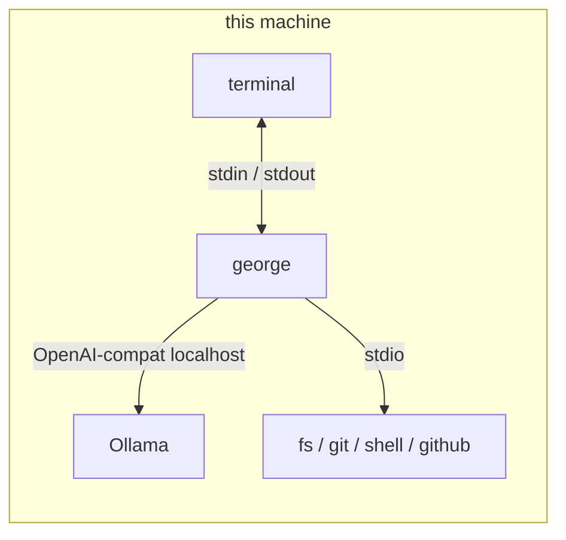

# Local model

george is a CLI. You run it in a repo, next to a local OpenAI-compatible
server (Ollama in the examples below). It is not a systemd unit and it does
not stay up after you quit. Install and the first prompt:
[root readme](../readme.md). Harness contract: [design.md](design.md).
Diagrams: [architecture.md](architecture.md).



Logs are JSON on stderr of that process. Replies are stdout.

## Bring up the model

The eval grades one id. Pull that one:

```bash
ollama pull qwen3-coder:30b-a3b-q4_K_M
```

`george init` writes `~/.config/george/env` (mode 0600) already pointed
here. A variable set in the shell wins over the file.

```env
LLM_BASE_URL=http://127.0.0.1:11434/v1
LLM_API_KEY=ollama
LLM_MODEL=qwen3-coder:30b-a3b-q4_K_M
LLM_REASONING_EFFORT=none
```

A model the server does not have fails with
`model "…" was not found at LLM_BASE_URL` and points at `ollama list`.
Any other OpenAI-compatible base URL works the same way; the live numbers
only hold for the id they were run against.

Then, once:

```bash
george tools-fetch
```

That puts `fs-mcp`, `git-mcp`, `shell-mcp`, and `github-mcp` in
`~/.local/share/george/bin`. `george` puts that directory first on `PATH`
for its children. `cd` into a repo and run `george`.

From a clone of this repo, `make init` and `make run` are the same two
commands.

## What the loop does for a small model

| Failure mode | What george does |
| --- | --- |
| A fat catalog drowns the edit | `fs`, `git`, `shell`, and `github` stay `force = true`. Other prefixes wait for `mcp_enable`. `--tool-tier core` keeps `fs` and `git` to the tools a coding turn uses |
| Prefix joined the wrong way (`fs.file_get`, `git_status_get`) | Host repairs it and counts `prefix_alias` ([mcp.md](mcp.md)) |
| A near miss (`fs__get_file`) | At most five closest names, then one grammar-constrained retry |
| The call is printed as JSON | Salvage runs it |
| The round budget runs out | One landing call with tools withheld, so the turn still answers |
| Prompt cache thrash | Persona, summary, and history stay a byte-stable prefix. Hydration, health, the user line, and `[harness]` come after |
| Schema blowups | Boot logs `est_tokens`. `TOOL_SCHEMA_MAX_TOKENS` > 0 fails the start if the catalog is over |

`/tools` prints the live names. `/toolstats` counts the repairs.

## Latency: measure before tuning

On a local model the wait is usually **prefill** (the prompt re-read before
the first token) and **thinking tokens spent before the first tool call**.
Decode itself is steady. Both show up in the JSON log on stderr:

```bash
george 2>george.log
# another terminal
grep -E '"msg":"(model call|tool done|turn perf)"' george.log
```

| Log line | Fields | Read it as |
| --- | --- | --- |
| `model call` | `first_token_ms`, `dur_ms`, `volatile_est_tokens`, `prompt_est_tokens`, `schema_est_tokens`, native `prompt_tokens` when the server sent them | `first_token_ms` is prefill plus queue. The rest of `dur_ms` is decode. Present only while streaming |
| `tool done` | `name`, `dur_ms`, `result_chars` | Slow tool versus slow model. `result_chars` lands in the next round's tail |
| `turn perf` | `iterations`, `tool_calls`, `max_batch`, `recoveries`, `prompt_est_tokens`, `gen_est_tokens`, `prompt_tokens`, `completion_tokens`, `total_tokens`, `model`, `finish_reason`, `model_ms`, `tool_ms`, `total_ms`, `outcome` | Work per Completer round for the whole turn |

**`volatile_est_tokens` is what predicts `first_token_ms`, not the size of
the whole prompt.** Persona, summary, and history are byte-stable across
turns, so Ollama can reuse that prefix. The tail is re-read every call:
memory hydration, server health, the user line, the clock, and tool
results from earlier rounds in this turn. A long cached prefix is fine. A
long tail is not.

Tool schemas are part of that prefix only when their order does not change.
`Host.Tools()` is sorted for that reason. A reshuffled schema block misses
the cache and the next turn pays a full prefill.

Ollama's own timings are on its log (`prompt eval count`, `eval count`):

```bash
journalctl -u ollama -f
```

### Levers, cheapest first

| Lever | Where | Effect |
| --- | --- | --- |
| Stable prompt prefix | already the assembly order | The cached prefix is not re-billed as prefill when the tail is what changed |
| `OLLAMA_CONTEXT_LENGTH` | Ollama's environment. The eval uses `32768` | Ollama's default `num_ctx` is small. Overflow shifts the context and re-prefills every turn. `HISTORY_MAX_TOKENS` still defaults to `32000`, which can fill that window before schemas and tool results are added |
| `OLLAMA_KEEP_ALIVE=-1` | same | The weights stay resident. `ollama ps` should show `100% GPU` |
| `LLM_REASONING_EFFORT=none` | `~/.config/george/env` | Thinking tokens decode at full price before any tool runs. This is the template default |
| `TOOL_RESULT_MAX_CHARS` | same, default `6000` | A result is re-sent on later rounds of the turn, so the cap multiplies prefill. The last two rounds stay whole; older ones collapse to a one-line marker |
| Fewer tools | `mcp.toml` `tools` / `exclude`, `--tool-tier` | Schemas sit in the cached prefix once it is stable, and they still inflate the context the first time |
| `SPINUP_NOTICE_MS` | same, default `4000` | Does not make the turn faster. Prints a still-working line during silent prefill |
| `SHOW_THINKING=false` | same | Hides chain-of-thought on stdout. Pair it with `LLM_REASONING_EFFORT=none` so the tokens are not generated |
| A different model | `LLM_MODEL` | Only after the log says model time dominates tool time |

Restarting Ollama after a context or keep-alive change makes the next turn
cold. Leave it running across ordinary `george` sessions so the weights
stay resident.

### What you see while it thinks

`STREAM_REPLIES=true` (the default) prints tokens as they arrive, and
`TOOL_TRACE=compact` prints a mark as each tool in the batch finishes.
Prefill itself is silent. `SPINUP_NOTICE_MS` covers that gap:

- The first turn after `george` starts prints a still-working line
  immediately. That turn loads the weights or fills an empty prompt cache.
- Later turns print one only after the threshold, which is the signal for
  a cache miss. Nothing in the OpenAI-compatible API reports a miss.
  `ollama ps` shows the model resident either way.

The first real token replaces that line.

## Host signals

No metrics port. RAM, GPU, and timing are already on the machine.

Ollama loads weights into GPU memory. `top` shows a small RSS for the
`ollama` process. Ask Ollama and the GPU:

```bash
ollama ps
# SIZE = weights + KV cache. PROCESSOR should be 100% GPU.
# UNTIL = keep-alive; forever under OLLAMA_KEEP_ALIVE=-1.
watch -n2 nvidia-smi          # NVIDIA
amdgpu_top                    # AMD APU (GTT = the model in shared RAM)
```

On a unified-memory machine, `free -h` drops when a model loads even
though no process shows the weights. `amdgpu_top`'s GTT line is the number
that moves.

george and its MCP children are ordinary processes in the terminal's
session. Their RSS is `ps` on `george`, `fs-mcp`, `git-mcp`, `shell-mcp`,
and `github-mcp`. There is no `george status` and no heartbeat.

Because the log is JSON, `jq` is the ad-hoc report:

```bash
jq -r 'select(.msg=="turn perf")
       | [.total_ms,.model_ms,.tool_ms,.iterations,.tool_calls,.max_batch,.recoveries,.outcome]
       | @tsv' george.log | sort -rn | head
```

In the REPL: `/perf`, `/tokens`, `/memstats`, `/toolstats`. The database is
`~/.local/share/george/george.db`. Open it with `sqlite3`.
