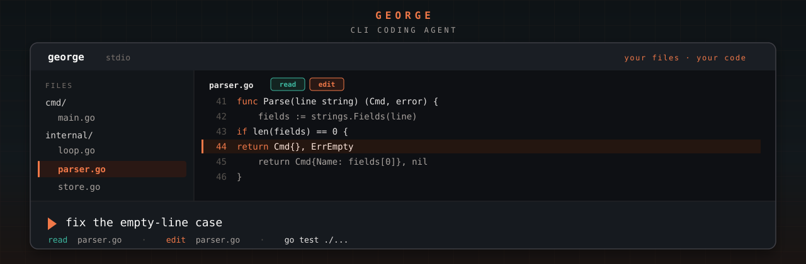
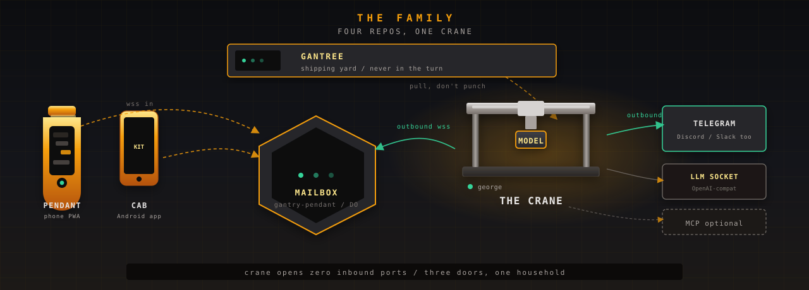
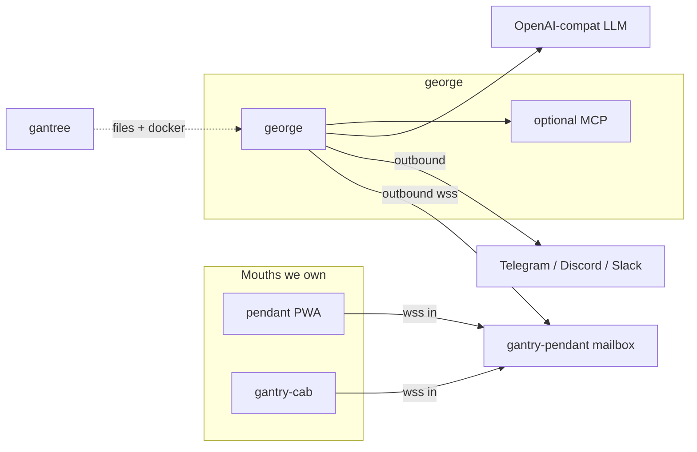

#  george

<p align="center">
  
</p>

<!-- Hub uses docs/dockerhub.md + assets/banner.png (SVG/mermaid break on Docker Hub). -->

<p align="center">
  <a href="https://github.com/shotah/george/actions/workflows/ci.yml"></a>
  <a href="https://github.com/shotah/george/actions/workflows/docker.yml"></a>
  <a href="https://github.com/shotah/george/actions/workflows/ci.yml"></a>
  <a href="https://hub.docker.com/r/shotah/george"></a>
  <a href="https://hub.docker.com/r/shotah/george"></a>
</p>

> **george** — the coding assistant. One process, one local model, MCP
> tools, stdin/stdout. You call him by name.

**The product is the assistant.** A Distroless Go process you run. One
persona. One OpenAI-compatible model on the local socket. With no
`CHANNEL` set he talks on stdin/stdout. Memory you can `sqlite3`.
`/new` distills; it does not lobotomize.

```text
static binary + persona + any OpenAI-compat LLM  →  outbound chat
```

Nothing listens. There is no dashboard in the thing you talk to. Health
is an exit code, not a port. Chat, memory, cron, and web search work
with **zero extra tools** — MCP is a grant you add later.

The engineering budget went into the **loop**: parallel tool batches,
repairs so a small local model can finish a turn, context that does not
rot, personality that survives a reset. Console, metrics, and fleet
live one layer up in **[gantree](https://github.com/shotah/gantree)** —
the shipping yard — and never sit in a chat turn. The mouth we run is
**[gantry-pendant](https://github.com/shotah/gantry-pendant)** (phone
PWA) and **[gantry-cab](https://github.com/shotah/gantry-cab)**, a
native Android app on that same backend. Android Auto is one surface
of Cab, not the whole app. Goals, todos, settings, and voice live
there. Telegram stays an option.

If you need a team workspace on day one, this is the wrong repo — and
that's fine.

---

## The family

Four public repos. This one is the product. The others exist so you can
operate it and talk to it without anyone sitting in a token path.

<p align="center">
  
</p>

| Repo | Job | How it talks |
| --- | --- | --- |
| **This repo** | The crane. One process, one person, one model. | Dials out. Reads env + files. Never learns the yard exists. |
| **[gantree](https://github.com/shotah/gantree)** | Shipping yard. Board, grants, doctor, spend. | Writes `.env`, `mcp.toml`, persona, Docker. Pulls logs. Never in a chat turn. |
| **[gantry-pendant](https://github.com/shotah/gantry-pendant)** | Handheld + mailbox. Phone PWA + Cloudflare Durable Object. | Phone and crane both **dial in**. Zero inbound ports on the Mini. |
| **[gantry-cab](https://github.com/shotah/gantry-cab)** | Native Android app. Also Android Auto. | Dials the pendant mailbox. Not a second Worker. |

Telegram, Discord, and Slack are vendor mouths: the crane dials them
directly. Pendant and cab go through the mailbox we own. MCP binaries
are optional children on `PATH` — not a fifth product.

The work list after the fork is **[docs/todo.md](docs/todo.md)**.



---

## Hello

You need an OpenAI-compatible model on this machine (Ollama, llama.cpp, or
an API you already have). With no `CHANNEL` set, george talks on stdin/stdout.

```bash
git clone https://github.com/shotah/george.git && cd george
make init
cp .env.example .env
# set in .env:
#   LLM_BASE_URL=http://127.0.0.1:11434/v1
#   LLM_API_KEY=ollama
#   LLM_MODEL=...
make run
```

Send `/status`. The files `george init` copies are in
**[examples/](examples/)**.

### Drop in a different model

The agent does not care which endpoint you picked. Set these three and restart:

| You have | Set |
| --- | --- |
| Ollama on this machine | `LLM_BASE_URL=http://127.0.0.1:11434/v1`, `LLM_API_KEY=ollama`, `LLM_MODEL=<id>` |
| Another OpenAI-compatible API | `LLM_BASE_URL` + `LLM_API_KEY` + `LLM_MODEL` |

```bash
# .env — a cloud endpoint, for instance
LLM_BASE_URL=https://generativelanguage.googleapis.com/v1beta/openai
LLM_API_KEY=...
LLM_MODEL=gemini-3.5-flash
```

### Beside this process

| Path | When |
| --- | --- |
| **[gantree](https://github.com/shotah/gantree)** | Console, metrics, grant tools, several agents |
| **[gantry-pendant](https://github.com/shotah/gantry-pendant)** | Phone chat we own (`CHANNEL=pendant`) |
| **[gantry-cab](https://github.com/shotah/gantry-cab)** | Native Android app on the pendant mailbox. Android Auto is one surface. |

Scaffolds: **[examples/README.md](examples/README.md)**.

---

## Chat is the console

Ops live in the same chat you already opened. No second UI in *this*
binary, no inbound port. Type `/help` anytime. Graphs, a board of
agents, MCP grants without SSH — that is
**[gantree](https://github.com/shotah/gantree)**. It never sits in a
chat turn.

| Command | What it does |
| --- | --- |
| `/status` `/perf` `/tokens` | Session bounds, trajectory (invocations / tools / batch), prompt size |
| `/tools` `/examples` `/planner` `/aims` `/new` `/cancel` | Catalog, ideas, daily planning session, aim ledger, reset, abort |
| `/auth` | Headless MCP login — paste a code; no laptop callback |

**[Pendant](https://github.com/shotah/gantry-pendant)** is the mouth
(`CHANNEL=pendant`): goals, todos, settings, and voice on a phone we
own. Cab is the native Android app on that same backend, Android
Auto included. Telegram, Discord,
and Slack stay vendor options (one `CHANNEL` per process). Headless
OAuth: **[docs/auth.md](docs/auth.md)**.

### Two files, not a catalog

Long-horizon means the person is still there tomorrow. Most agents *feel*
like someone after a long chat, then `/new` wipes them.

| File | Who writes it |
| --- | --- |
| `PERSONA.md` | You — who it should be, who you are (name, timezone, languages), what you are aiming at |
| `SELF.md` | The agent — voice, jokes, rituals, a few north-star aims that survive `/new` (you can delete any line) |

MCP tools are **not** listed in `PERSONA.md`. They come from the live catalog
(`/tools`, this turn's schemas, `[mcp prefixes]`). Keep `PERSONA.md` short
(examples over rule dumps) or the middle of it gets ignored. Progress logs
and dated to-dos are memory / cron, not persona.

The shipped seed is built around **goals**: you name the aim, the agent
nudges toward it where today's tools disagree with it, does the legwork
(the flight, the event, the reminder) the same turn, and treats an empty
day as a hole to fill — not "nothing today."

Keep `PERSONA.md` short. Audit or delete a line in `SELF.md` when the voice drifts.

### Tested two ways

| Contract | What it pins | Runs |
| --- | --- | --- |
| **Goldens** | The bytes the model sees — pendant JSON → `Handle` → Completer request → HTTP body, every `[harness]` stamp, on the OpenAI *and* Gemini layouts | `go test ./...`, every push, free |
| **Behavior eval** | What the model *did* with the shipped seed on a live model — tools called and their args, `[wait]` armed, `[silent]` or not, the memory row, the cron job. Never the sentence | `make integration-test`, release gate, paid |

Seven scenarios from the goals doc, N runs each, every run must pass; a
rule that holds two times in three is a rule the persona is not carrying.
Setup: **[docs/eval_setup.md](docs/eval_setup.md)**.

---

## Read next

| If you want… | Go here |
| --- | --- |
| Work after the fork | **[docs/todo.md](docs/todo.md)** |
| Why this tree, not goose | **[docs/fork-cli-agent.md](docs/fork-cli-agent.md)** |
| Run the live behavior eval (`make integration-test`) | **[docs/eval_setup.md](docs/eval_setup.md)** |
| How the harness is put together | **[docs/architecture.md](docs/architecture.md)** |
| Env, loop, memory, security | **[docs/design.md](docs/design.md)** |
| Wiring MCP tools | **[docs/mcp.md](docs/mcp.md)** |
| Console, metrics, or several agents | **[gantree](https://github.com/shotah/gantree)** |
| Chat from a phone we own | **[gantry-pendant](https://github.com/shotah/gantry-pendant)** |
| Chat from the Android app | **[gantry-cab](https://github.com/shotah/gantry-cab)** |

The harness is a small static Go binary. Tools are optional MCP processes.
We spent the budget on the loop so a **small local model** can finish a
tool turn instead of ERROR — that's the production story, not a requirement
to start. Long-horizon planning is the reason the loop, memory, cron, and
`SELF.md` exist.

## License

MIT — see [LICENSE](LICENSE).
